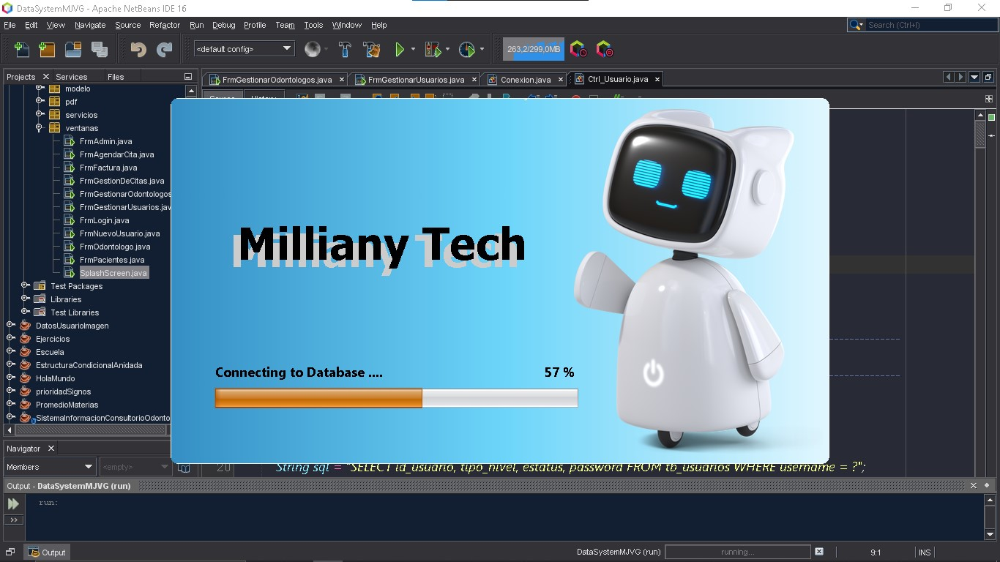
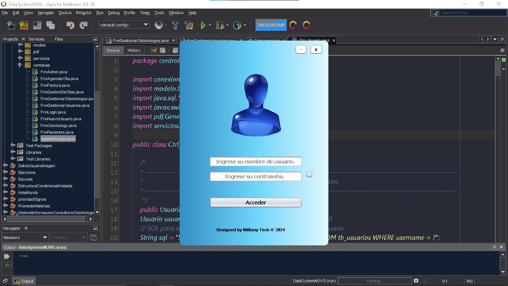
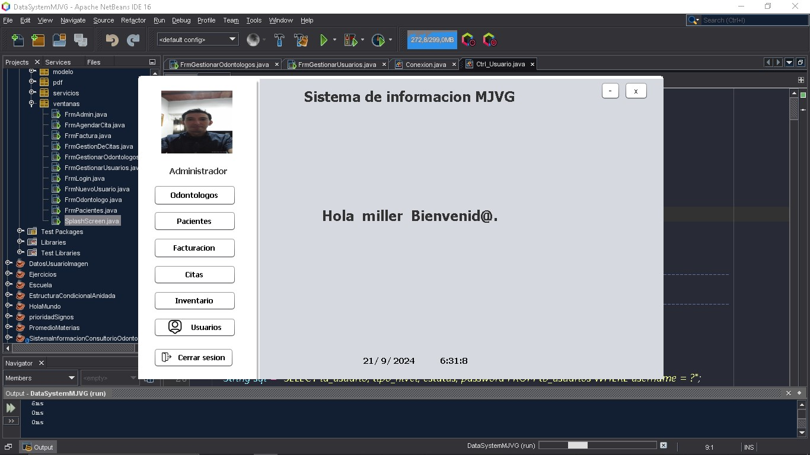
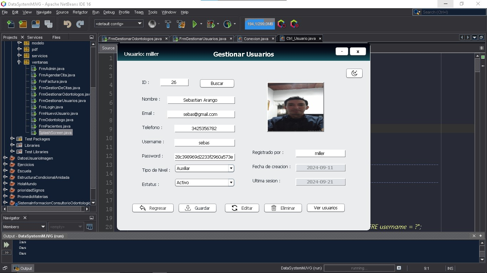
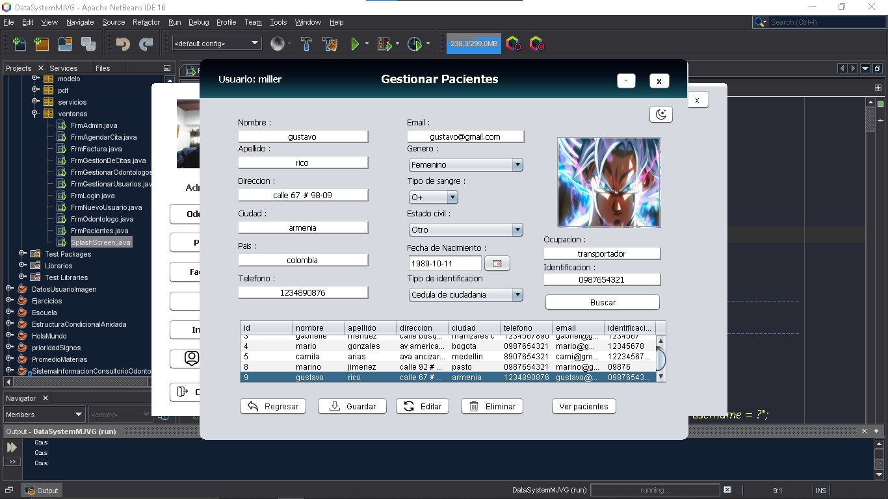

<h3>Sistema Informacion Consultorio Odontologico Maria Jose Velez G</h3>

<h5>Splashscreen</h5>

<h5>Login</h5>

<h5>Admin</h5>

<h5>Gestion Usuarios</h5>

<h5>Gestion Pacientes</h5>

## 🎥 Demostración de la Aplicación

¡Descubre cómo funciona nuestra aplicación en acción! 🎬  
Haz clic en el siguiente enlace para ver un video demostrativo donde explicamos sus principales características y funcionalidades:

[Mira el video aquí](https://vimeo.com/1011675408?share=copy)

## Tecnologías Utilizadas

- NetBeans
- Git
- Github
- Java

  

<h3>link Repositorio Github</h3>
https://github.com/Miller38/DataSystemMJVG

## Créditos.
## Designed by Milliany Tech ®2024
Yuliet Faizuli Pachon Caro - 
Nestor Fabian Gutierrez Sabogal - 
Jorge Miller Gutierrez Ospina
